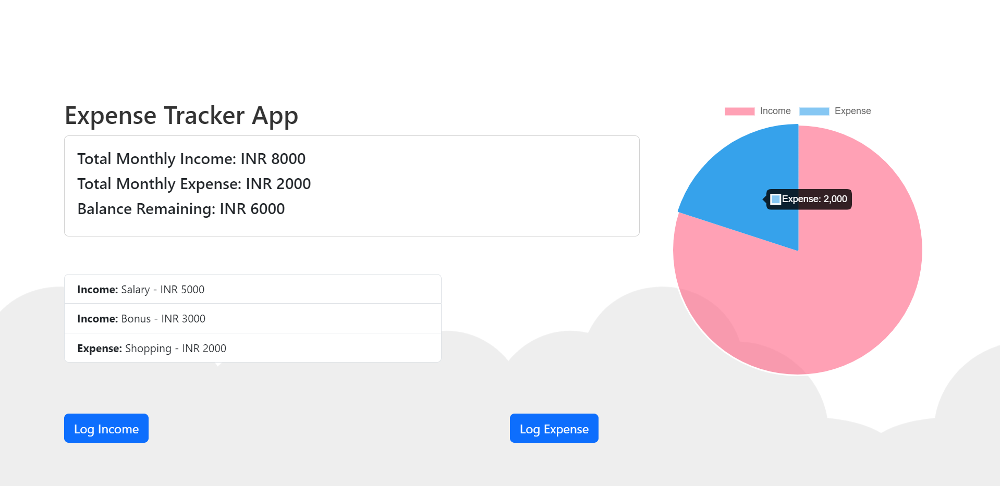
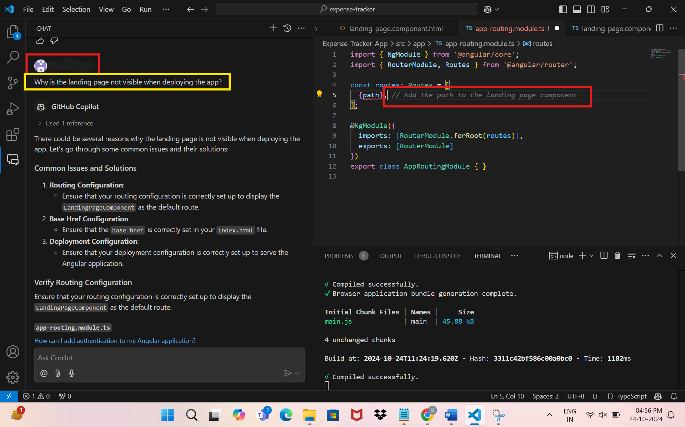
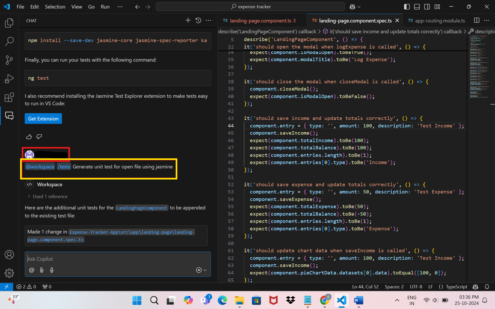

# Angular Expense Tracker App

This app was built entirely through Copilot prompts! A good starting point to explore the capabilities of Copilot integration in VS code, by learning to build a simple app. Checkout some of the prompts that were used to build this app below.

---

## 🚀 Project Features

The Angular app helps track users' total income, expenses, balance and visualize their spending via chart. It features a clean UI, modal dialogs for adding entries, a running list of all transactions, with data stored in memory.  
**Note:** All data will be lost if the page is refreshed or the browser/tab is closed.

---

## 🛠️ Screens

### 🔹 Landing Page


### 🔹 Log Income Modal


### 🔹 Log Expense Modal


### 🔹 Pie Chart Representation


---

## 🤖 GitHub Copilot Prompts Used

### 📌 High-level planning: (Start with a brief idea of what you are trying to build)
> “I want to build an expense tracker app using Angular, which helps user to track their daily expenses and budget. Users should be able to log their monthly income and everyday expenses. The user interface must be built using Bootstrap. Mention high level steps to build this app.”


### 📌 UI design: (Bounce-off some design ideas for look and feel)
> “I want to build the landing page which will be divided into top and bottom sections. The top section should mention the total monthly income, total monthly expense, and balance remaining. In the right side the same must be indicated through a pie chart. The bottom section should contain a button called 'log' in the bottom right corner."


### 📌 Debugging: (Take help to troubleshoot issues)
> “Debug terminal error while generating component to create landing page. ng : File ... cannot be loaded because running scripts is disabled on this system.”



### 📌 Concept Explanation: (Ask to understand the framework, design or just about anything)
> "Why should Bootstrap be used?"


### 📌 Unit Testing: (Auto generate unit tests)
> "Generate unit tests using Jasmine"



---

## 🧪 Copilot Capabilities Explored

- Complex task breakdown
- UI design and layout suggestions
- Debugging assistance
- Concept explanations
- Code/command generation
- Pair programming through inline comments
- Unit test generation

---

## 📦 How to Run the App

```bash
npm install
ng serve
```
Navigate to [http://localhost:4200/](http://localhost:4200/) in your browser.

---